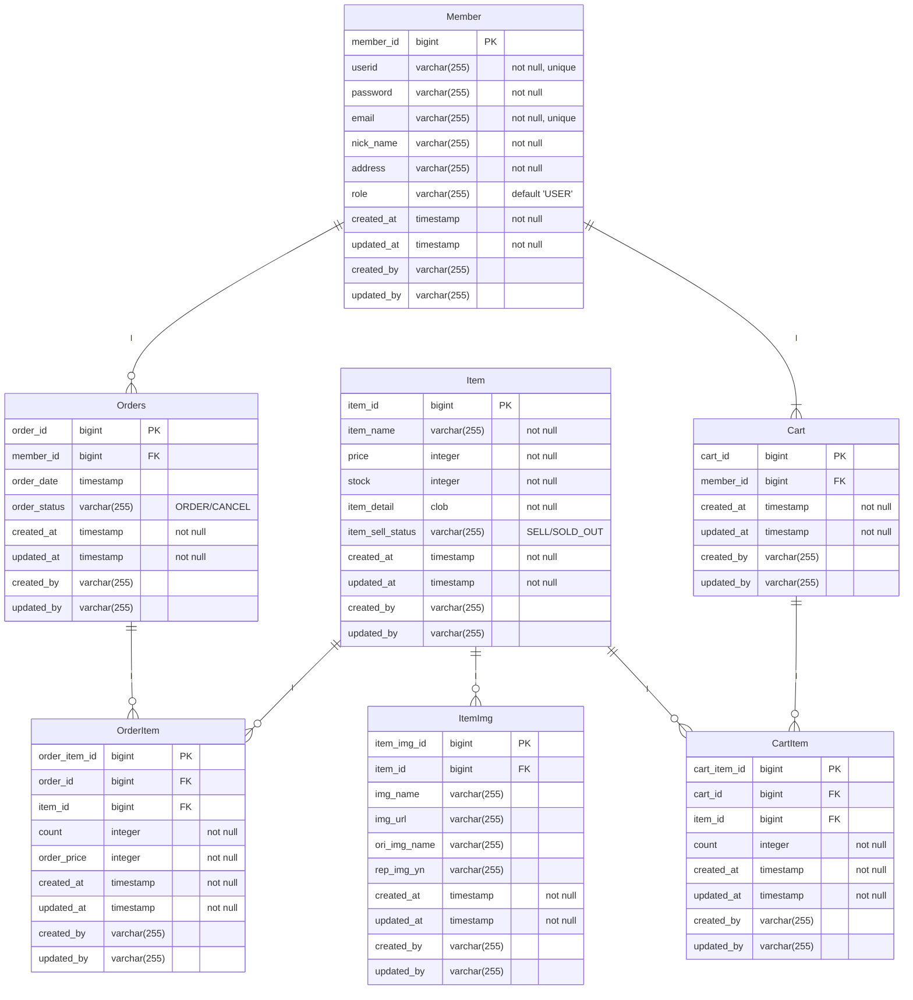

# ShoppingMall_Project
 '스프링부트 쇼핑몰프로젝트 with JPA' 책을 참조하여 공부하고 있습니다.

## 프로젝트 생성 및 세팅
- 'https://start.spring.io/' 에서 프로젝트 생성
    - SpringBoot `2.7.13`
    - Gradle Groovy `7.6.1`
    - java `17`
    - Dependencies
        - WEB : `Spring Web`
        - SQL : `Spring Data JPA`  `H2 Database`
        - DEVELOPER TOOLS : `Lombok`
        - SECURITY : `Spring Security`
        - I/O : `Validation`
        - External Library : `com.github.gavlyukovskiy:p6spy-spring-boot-starter:1.5.7`
        - TEMPLATE ENGINES : `Thymeleaf`, `Thymeleaf Extras Springsecurity5`
- IDE : IntelliJ
- DB : H2 `jdbc:h2:tcp://localhost/~/shop`

## 프로젝트 일정
- 7/5 전체적인 엔티티 설계, Item Entity, Member Entity 개발, Thymeleaf layout 잡기
- 7/6 시큐리티를 이용한 회원가입 및 로그인, 회원정보수정(추가기능) 
- 7/7 `Cart`, `Order` Entity 설계, 연관관계 매핑, Auditing 수정
- 7/9 상품 등록
- 7/10 상품 수정
- 7/11 상품 목록 조회 및 상품 개별 조회
- 나중에 보완 할 것
  - [ ] csrf 공부하기
  - [ ] url을 주소창에 입력해서 강제접근 시(principal==null) login 화면으로 redirect 하기
  - [ ] 시큐리티가 적용되어 있어서 테스트 코드 짜는게 너무 힘들다...

## 엔티티 설계

- 회원 정보를 중심으로 연관관계 매핑
  - `member` 한명은 여러개의 `orders`를 가질 수 있음
  - `order` 하나는 여러개의 `orderItem`을 가질 수 있음
  - `member` 한명은 한개의 `cart`를 가질 수 있음
  - `cart` 하나는 여러개의 `cartItem`을 가질 수 있음
  - `Item`하나는 여러개의 `orderItem`과 여러개의 `cartItem`이 될 수 있음
  - `Item`하나에 여러개의 `ItemImage`를 가질 수 있음
- 회원 인증, 인가는 시큐리티로 처리
  - 인증이 필요없는 경우 : 상품상세 페이지
  - 인증이 필요한 경우 : 상품 주문
  - 관리자 권한이 필요한 경우 : 상품등록
- Jpa Auditing 사용하기
  - 생성일, 수정일, 생성자, 수정자 데이터 추적
  - 시큐리티의 `SecurityContextHolder.getContext().getAuthentication()`
- `Member`
  - `userid`, `email` 은 `unique`
  - 로그인은 `userid`로 수행
  - Dto 로 입력받는 모든 필드 `NotBlank`
  - 필드에러 시 BindingResult 로 처리
  - 아이디, 이메일 중복 시 `alert` 처리
- `Item`
  - `Item`은 여러개의 `ItemImg` 가짐. 단방향 연관관계 설정
  - `ItemImg`는 원래 파일이름, 고유 파일이름, 저장위치정보를 가짐.
- `Order`
  - `Order`로 엔티티 생성 시 table 생성 불가 (DDL Error) => 테이블명 별도 지정
  - 한명의 Member는 여러개의 Order를 가짐 (양방향, 1:n)
  - Member는 OrderList를 조회함
  - `OrderItem`
    - Order가 생성되면 OrderItem 수량만큼 Item 재고 감소 (재고가 부족하면 Order 안됨)
    - Order가 취소되면 OrderItem 수량만큼 Item 재고 증가
    - [ ] Cart에서 Order로 넘어가면 재고변동 없음
  - Order가 삭제되면 OrderItem도 삭제 (cascade = CascadeType.ALL, orphanRemoval = true)
- `Cart`
  - [ ] Cart의 아이템을 전체주문하기, 부분주문하기 (주문이 일어나면 Cart에서 CartItem 삭제)
  - Cart가 Member를 참조(단방향, 1:1)
  - `CartItem`
    - Cart에 CartItem 추가되면 그 수량만큼 Item 재고 감소
    - Cart에서 CartItem 삭제되면 그 수량만큼 Item 재고 증가
    - [ ] Cart에서 Order로 넘어가면 재고변동 없음
  - Cart가 삭제되면 CartItem도 삭제 (cascade = CascadeType.ALL, orphanRemoval = true)

## 서비스 로직
### 📑 상품 등록 및 조회
#### 상품 등록
- Image 파일전송을 위하여 form enctype=`"multipart/form-data"` 설정
  - `ItemFormDto`로부터 Item정보를 받아오고 (form-data)
  - `MultipartFile`로부터 ItemImage정보를 받아옴. (RequestParam)
  - `ItemFormDto`의 값은 Controller에서 @Valid로 검증
  - Image의 원래이름과, UUID로 바꾼 고유이름, 로컬경로 DB에 저장

## Trouble Shooting
#### 📑 회원가입 페이지 접근해서 `submit`하면 401(Unauthorized) 에러 발생
```html
<!-- 스프링 시큐리티를 사용할 경우 
모든 POST 방식의 데이터 전송에는 기본적으로 CSRF 토큰값 있어야 함. -->
<input type="hidden" th:name="${_csrf.parameterName}" th:value="${_csrf.token}">
```
- securityConfig 에서 permitAll() 해줬음
- GET 요청에 대해서는 csrf 검증을 수행하지 않음
- csrf().disable() 및 html 파일에서 해당내용 삭제 시 정상 작동함.

#### 📑 회원정보 수정 시
- @GetMapping
  - 회원정보 수정 페이지 접근 시, 시큐리티의 Principal 클래스의 member 정보 가져옴
  - `model.addAttribute("updateMember", updateMember)`에 담아줌
- @PostMapping
  - `@ModelAttribute("updateMember")`에 담긴 정보 가져와서 
  - `input`에 현재 member의 정보 보여주도록 하고
  - 사용자가 수정한 값에 대하여 update 함.
- 회원정보 수정 시 email 중복에 대한 검증은
  - 최초 가입할때는 db에 값 있는지 확인해서 처리하면 되는데
  - 수정 시에는 본인의 email 을 읽어와서.. 동일한 방식으로 처리 시 무조건 중복발생
  - SQL문 검증에서 .. 중복값 입력되면 발생되는 에러를 잡아서 예외처리