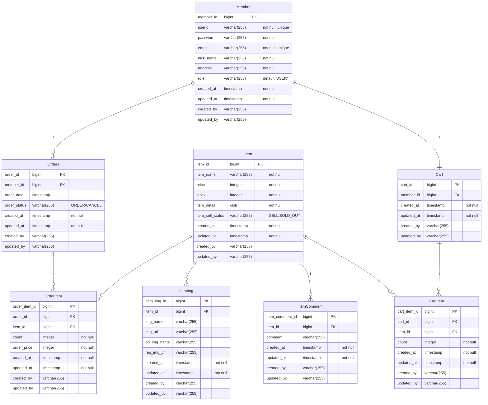

# ShoppingMall_Project
 '스프링부트 쇼핑몰프로젝트 with JPA' 책을 참조하여 공부하고 있습니다.

## Navigation
- [프로젝트 생성 및 세팅](#프로젝트-생성-및-세팅)
- [프로젝트 일정](#프로젝트-일정)
- [엔티티 설계](#엔티티-설계)
- [서비스 로직](#서비스-로직)
- [Trouble Shooting](#trouble-shooting)

## 프로젝트 생성 및 세팅
- 'https://start.spring.io/' 에서 프로젝트 생성
    - SpringBoot `2.7.13`
    - Gradle Groovy `7.6.1`
    - java `17`
    - Dependencies
        - WEB : `Spring Web`
        - SQL : `Spring Data JPA`  `H2 Database`
        - DEVELOPER TOOLS : `Lombok`
        - SECURITY : `Spring Security`
        - I/O : `Validation`
        - External Library : `com.github.gavlyukovskiy:p6spy-spring-boot-starter:1.5.7`
        - TEMPLATE ENGINES : `Thymeleaf`, `Thymeleaf Extras Springsecurity5`
- IDE : IntelliJ
- DB : H2 `jdbc:h2:tcp://localhost/~/shop`

## 프로젝트 일정
- ✅ 7/5 전체적인 엔티티 설계, Item Entity, Member Entity 개발, Thymeleaf layout 잡기
- ✅ 7/6 시큐리티를 이용한 회원가입 및 로그인, 회원정보수정(추가기능) 
- ✅ 7/7 `Cart`, `Order` Entity 설계, 연관관계 매핑, Auditing 수정
- ✅ 7/9 상품 등록
- ✅ 7/10 상품 수정, 상품 목록 조회 및 페이징, 메인화면 페이징 
- ✅ 7/11 상품 상세페이지, 주문 
  - 주문 List queryDsl 사용 (책에서는 jpql로(`@Query`) 처리함)
  - Dto 객체에 QueryDsl 사용 시 반드시 `@QueryProjection` 추가해주기
- ✅ 7/12 카트에 상품추가, 수정, 삭제, 카트 목록 보기, 카트에 있는 상품 주문하기
  - QueryDsl로 Join 하기  
- ✅ 7/13 csrf 해결, ManageItemDto 만들고 쿼리 수정, ItemComment 생성 
- 7/14 상품정보에 상품평(댓글 추가)
  - ItemController post메서드 추가, html 수정 필요
- 나중에 보완 할 것
  - [x] ~~csrf 공부하기: 적용완료~~
  - [ ] url을 주소창에 입력해서 강제접근 시(principal==null) login 화면으로 redirect 하기
  - [ ] 시큐리티가 적용되어 있어서 테스트 코드 짜는게 너무 힘들다...
  - [ ] 첨부파일을 추가하거나 수정은 되는데, 기존에 첨부되어있는 파일 수를 줄일수가 없음.
  - [x] ~~상품관리 `Page<Item>` 에서 Item Entity 그대로 내보내고 있음:완료~~
  - [x] ~~이미지파일 엑박 : 해결~~
  - [ ] 상품 상세정보 아래에 상품평 남기기
  - [ ] 원래 쇼핑몰 서비스는 할인정책 등으로 인하여 orderPrice와 itemPrice가 다르다고 했음
    - 현재는 orderPrice에 item 가격 넣어놈.. (cart에서 주문 시 orderprice가 안넘어가는 문제가 있어서..)
  - [ ] 구매이력 확인 시 개별 상품에 대한 총 합계만 나옴. 한 주문에 대한 전체 상품 합계 추가 -> jquery
  - [ ] init 데이터 다시 넣고 테스트 하기, css 손보기

## 엔티티 설계

- 회원 정보를 중심으로 연관관계 매핑
  - `member` 한명은 여러개의 `orders`를 가질 수 있음
  - `order` 하나는 여러개의 `orderItem`을 가질 수 있음
  - `member` 한명은 한개의 `cart`를 가질 수 있음
  - `cart` 하나는 여러개의 `cartItem`을 가질 수 있음
  - `Item`하나는 여러개의 `orderItem`과 여러개의 `cartItem`이 될 수 있음
  - `Item`하나에 여러개의 `ItemImage`를 가질 수 있음
- 회원 인증, 인가는 시큐리티로 처리
  - 인증이 필요없는 경우 : 상품상세 페이지
  - 인증이 필요한 경우 : 상품 주문
  - 관리자 권한이 필요한 경우 : 상품등록
- Jpa Auditing 사용하기
  - 생성일, 수정일, 생성자, 수정자 데이터 추적
  - 시큐리티의 `SecurityContextHolder.getContext().getAuthentication()`
- `Member`
  - `userid`, `email` 은 `unique`
  - 로그인은 `userid`로 수행
  - Dto 로 입력받는 모든 필드 `NotBlank`
  - 필드에러 시 BindingResult 로 처리
  - 아이디, 이메일 중복 시 `alert` 처리
- `Item`
  - `Item`은 여러개의 `ItemImg`,`ItemComment` 가짐. 단방향 연관관계 설정
  - `ItemImg`는 원래 파일이름, 고유 파일이름, 저장위치정보를 가짐.
- `Order`
  - `Order`로 엔티티 생성 시 table 생성 불가 (DDL Error) => 테이블명 별도 지정
  - 한명의 Member는 여러개의 Order를 가짐 (양방향, 1:n)
  - Member는 OrderList를 조회함
  - `OrderItem`
    - Order가 생성되면 OrderItem 수량만큼 Item 재고 감소 (재고가 부족하면 Order 안됨)
    - Order가 취소되면 OrderItem 수량만큼 Item 재고 증가
  - Order가 삭제되면 OrderItem도 삭제 (cascade = CascadeType.ALL, orphanRemoval = true)
- `Cart`
  - Cart의 아이템을 전체주문하기, 부분주문하기 (주문이 일어나면 Cart에서 CartItem 삭제)
  - Cart가 Member를 참조(단방향, 1:1)
  - Cart가 삭제되면 CartItem도 삭제 (cascade = CascadeType.ALL, orphanRemoval = true)

## 서비스 로직
### 📑 상품 등록 및 조회
#### 상품 등록
- Image 파일전송을 위하여 form enctype=`"multipart/form-data"` 설정
  - `ItemFormDto`로부터 Item정보를 받아오고 (form-data)
  - `MultipartFile`로부터 ItemImage정보를 받아옴. (RequestParam)
  - `ItemFormDto`의 값은 Controller에서 @Valid로 검증
  - Image의 원래이름과, UUID로 바꾼 고유이름, 로컬경로 DB에 저장
#### 상품 수정
- @pathVariable `itemId`로 Item 정보를 받아옴
  - 이때 `item`에 연관 된 ItemImage정보를 Dto에 넣어줌
- 상품 수정 시 파일과 `item_img_id` 같이 form전송
  - list의 size가 항상 5!!! => 첨부파일 폼을 5개 만들어놓았으므로! 
```html
<input type="file" class="custom-file-input" name="itemImgFile">
<input type="hidden" name="itemImgIds" th:value="${itemImg.id}">
```
#### 상품 관리
- JPA + QueryDsl 구현하기 위하여
  - 사용자 정의 인터페이스 작성 `ItemRepositoryCustom`
  - 사용자 정의 인터페이스 구현 `ItemRepositoryCustomImpl`
  - 사용자 정의 인터페이스 상속 `ItemRepository extends ItemRepositoryCustom`
- 페이징 화면 구성하기
  - start : (현재페이지번호/보여 줄 페이지 수) + 1
  - end : start + (보여 줄 페이지 수 - 1)
  - 첫번째 페이지면 `Previous` 클릭 불가
  - `Privious` 클릭 시 이전 페이지로 이동 (javascript page함수 호출)
  - 페이지 번호 클릭 시 해당 페이지로 이동 (javascript page함수 호출)
  - 마지막 페이지일 경우 `Next` 클릭 불가
  - `Next` 클릭 시 다음 페이지로 이동 (javascript page함수 호출)
  - `/admin/items/1?searchDateType=all&searchSellStatus=&searchBy=itemName&searchQuery=`
#### 메인 페이지
  - 로그인 하지 않아도 상품목록 확인 가능
  - 상품 클릭 시 상세화면은 로그인 필요
### 📑 주문
#### 주문 생성 및 취소
- 웹페이지의 새로고침 없이 서버에 주문을 요청하기 위해서 비동기 방식 사용
  - `@RequestBody` , `@ResponseBody` 사용
  - 주문하면 상품 재고 감소
  - 주문 취소하면 상품 재고 증가
#### 주문 조회
- 로그인 된 사용자의 주문 내역 조회, 페이징
### 📑 장바구니
#### 장바구니 생성 및 아이템 추가
- 비동기 방식 사용 (`@RequestBody` , `@ResponseBody`)
- 해당 아이디에 카트아이디가 있으면 아이템 추가
- 없으면 카트 생성 후 추가
#### 장바구니 수량 수정 및 삭제
- 비동기 방식 사용 (`@RequestBody` , `@ResponseBody`)
- 로그인 된 사용자 정보 인증 후 
- 수량 수정 시 새로고침 없이 현재페이지
- 아이템 삭제 시 `/cart` 호출하여 새로고침
#### 장바구니에서 주문하기
- 여러개의 상품을 하나의 주문에 담을 수 있음 (체크박스로 판단)
- `CartOrderDto`를 통해 cart에 있는 `cart_item_id` 가져옴
- `cart_item_id`로 `OrderDto` List 만들어서 `order` 생성
- 주문 한 상품은 장바구니에서 삭제하는 로직 추가


## Trouble Shooting
#### 📑 회원가입 페이지 접근해서 `submit`하면 401(Unauthorized) 에러 발생
```html
<!-- 스프링 시큐리티를 사용할 경우 
모든 POST 방식의 데이터 전송에는 기본적으로 CSRF 토큰값 있어야 함. -->
<input type="hidden" th:name="${_csrf.parameterName}" th:value="${_csrf.token}">
```
- securityConfig 에서 permitAll() 해줬음
- GET 요청에 대해서는 csrf 검증을 수행하지 않음
- csrf().disable() 및 html 파일에서 해당내용 삭제 시 정상 작동함.

#### 📑 회원정보 수정 시
- @GetMapping
  - 회원정보 수정 페이지 접근 시, 시큐리티의 Principal 클래스의 member 정보 가져옴
  - `model.addAttribute("updateMember", updateMember)`에 담아줌
- @PostMapping
  - `@ModelAttribute("updateMember")`에 담긴 정보 가져와서 
  - `input`에 현재 member의 정보 보여주도록 하고
  - 사용자가 수정한 값에 대하여 update 함.
- 회원정보 수정 시 email 중복에 대한 검증은
  - 최초 가입할때는 db에 값 있는지 확인해서 처리하면 되는데
  - 수정 시에는 본인의 email 을 읽어와서.. 동일한 방식으로 처리 시 무조건 중복발생
  - SQL문 검증에서 .. 중복값 입력되면 발생되는 에러를 잡아서 예외처리

#### 📑 QueryDsl 사용을 위한 EntityManager 주입
- 기존: `ItemRepositoryCustomImple` 생성자에다가 주입해줌
```java
@RequiredArgsConstructor
public class ItemRepositoryCustomImpl implements ItemRepositoryCustom{

    private final JPAQueryFactory queryFactory;
    
    public ItemRepositoryCustomImpl(EntityManager em) {
        this.queryFactory = new JPAQueryFactory(em);
    }
  ...
}
```
- 문제: `org.springframework.beans.factory.UnsatisfiedDependencyException` 발생
- 확인: `@Autowired`로 의존성 주입 안해줌...
```java
@RequiredArgsConstructor
public class ItemRepositoryCustomImpl implements ItemRepositoryCustom {

    private final JPAQueryFactory queryFactory;

    @Autowired
    public ItemRepositoryCustomImpl(EntityManager em) {
        this.queryFactory = new JPAQueryFactory(em);
    }
  ...
}
```
- 다른방법: Config 파일에서 `@Bean` 생성해주기
```java
@Bean
JPAQueryFactory jpaQueryFactory(EntityManager em) {
    return new JPAQueryFactory(em);
}
```

#### 📑 페이징 구현
- 문제
  - Controller에서 `/admin/items` 호출 시 목록 3개, 페이지 3개 생기는거 확인
  - `/admin/items/{page}` 로 호출이 안됨 (500 Error)
  - java.lang.IllegalStateException: Ambiguous handler methods mapped for '/admin/items/0'
  - RestController 만들어서 `/admin/items/{page}` 호출 시 이상없이 잘 됨. 
- 원인 
  - ItemId를 PathVariable로 가져오는 URI와
  - Page를 PathVariable로 가져오는 URI가 같아서 발생하는 문제
- 해결
  - URI 수정 해줌
```java
//기존
@GetMapping("/admin/items/{itemId}")
public String getItemDetail(@PathVariable("itemId") Long itemId, Model model)
        ...
}

@GetMapping(value = {"/admin/items", "/admin/items/{page}"})
public String adminItemPage(ItemSearchDto itemSearchDto,
            @PathVariable("page") Optional<Integer> page, Model model){
        ...
}
```
```java
//수정
@GetMapping("/admin/item/{itemId}")
public String getItemDetail(@PathVariable("itemId") Long itemId, Model model)
        ...
}
```
#### 📑 저장한 이미지 불러오기
- 문제 : 이미지파일 업로드 시 지정한 폴더 및 DB에는 저장 되나, 불러오는게 안됨.
- 확인
  - url 직접 입력하면 뜸
    - file:///.../ShoppingMallProject/images/item/c63ffd57-17b6-4be0-80b3-390b9e208e06.png
  - 웹에서 이미지 경로 확인 시 안뜸
    - http://localhost:8080/images/item/c63ffd57-17b6-4be0-80b3-390b9e208e06.png
- 해결
  - 외부경로 접근을 위하여 리소스 핸들러 설정
  - ".../ShoppingMallProject" 까지를 `localhost:8080` 으로 인식하는 거 같음!
```yaml
# 기존
itemImgLocation: .../ShoppingMallProject/shop/item
uploadPath: .../ShoppingMallProject/shop

# 변경
itemImgLocation: .../ShoppingMallProject/item
uploadPath: .../ShoppingMallProject/
```
- 추가
  - `SecutiryConfig` 에서 `/images/**` permitAll() 해줘야 로그인하지 않아도 보임
#### 📑 QueryDsl Join 시 cross join 발생
- H2 데이터베이스에서 쿼리문으로 조인 시 데이터 정상출력 확인
```sql
select * from cart_item 
join item_img
where cart_item.item_id = item_img.item_id 
  and cart_id=1 
  and item_img.rep_img_yn='Y';
```
- 문제 1: QueryDsl로 구현 시 join 문제 발생
- > java.lang.IllegalArgumentException: itemImg.item is not a root path
```java
.from(cartItem)
.join(cartItem.item, itemImg.item)
.where(
    cartItem.item.id.eq(itemImg.item.id),
    cartItem.cart.id.eq(cartId),
    itemImg.repImgYn.eq("Y")
)
```
- 시도 1: ItemImg를 바로 join해주니 cross Join 발생
```java
.from(cartItem)
.join(itemImg)
.where(
    cartItem.item.id.eq(itemImg.item.id),
    cartItem.cart.id.eq(cartId),
    itemImg.repImgYn.eq("Y")
)
```
```sql
select
    cartitem0_.cart_item_id as col_0_0_,
    item2_.item_name as col_1_0_,
    item2_.price as col_2_0_,
    cartitem0_.count as col_3_0_,
    itemimg1_.img_url as col_4_0_ 
from
    cart_item cartitem0_ 
inner join
    item_img itemimg1_ 
        on cross 
join
    item item2_ 
where
    itemimg1_.item_id=item2_.item_id 
    and cartitem0_.cart_item_id=? 
    and cartitem0_.item_id=itemimg1_.item_id 
    and itemimg1_.rep_img_yn=? 
order by
    cartitem0_.created_at desc
```
- 시도2: 조인조건 추가했으나 여전히 cross Join 발생
```java
.from(cartItem)
.join(itemImg)
.on(cartItem.item.id.eq(itemImg.item.id))
.where(
    cartItem.id.eq(cartId),
    itemImg.repImgYn.eq("Y") 
)
```
- 해결: 원래 중심에 있던 Item을 기준으로 join을 해줌
```java
.select(
    new QCartDetailDto(
            cartItem.id, item.itemName,
            item.price, cartItem.count,
            itemImg.imgUrl
    )
)
.from(item)
.join(cartItem).fetchJoin().on(item.id.eq(cartItem.item.id))
.join(itemImg).fetchJoin().on(item.id.eq(itemImg.item.id))
.where(
    cartItem.item.id.eq(itemImg.item.id),
    cartItem.cart.id.eq(cartId),
    itemImg.repImgYn.eq("Y")
)
.orderBy(cartItem.createdAt.desc())
.fetch();
```
```sql
select
    cartitem1_.cart_item_id as col_0_0_,
    item0_.item_name as col_1_0_,
    item0_.price as col_2_0_,
    cartitem1_.count as col_3_0_,
    itemimg2_.img_url as col_4_0_ 
from
    item item0_ 
inner join
    cart_item cartitem1_ 
        on (
            item0_.item_id=cartitem1_.item_id
        ) 
inner join
    item_img itemimg2_ 
        on (
            item0_.item_id=itemimg2_.item_id
        ) 
where
    cartitem1_.item_id=itemimg2_.item_id 
    and cartitem1_.cart_id=? 
    and itemimg2_.rep_img_yn=? 
order by
    cartitem1_.created_at desc
```
#### 📑 JQuery 화살표 함수
- jquery 문법 사용 시 화살표 함수를 사용하면 `this`를 못씀
- [참고블로그](https://triplexblog.kr/9)
- function() 의 this : 자기자신
- () => {} 의 this : 전역변수
```javascript
//기존 : ambiguous
$("input[name=cartChkBox]:checked").each(() => {
    const cartItemId = $(this).val();
    ...
})
//수정
$("input[name=cartChkBox]:checked").each(function () {
  const cartItemId = $(this).val();
...
})
```
#### 📑 csrf 설정
- 기존: 스프링시큐리티는 디폴트가 `csrf enable`
- 문제: form 전송 시 csrf 토큰값 담아서 보내도록 하였으나 401에러 발생 
```html
<form>
...
  <input type="hidden" th:name="${_csrf.parameterName}" th:value="${_csrf.token}">
</form>
```
- form 화면에 접근 시 스프링부트에서 띄우는 에러
```
2023-07-13 15:34:05.248 ERROR 18792 --- [nio-8080-exec-6] org.thymeleaf.TemplateEngine             : 
[THYMELEAF][http-nio-8080-exec-6] Exception processing template "members/memberForm": 
Exception evaluating SpringEL expression: "_csrf.token" (template: "members/memberForm" - line 73, col 63)

org.thymeleaf.exceptions.TemplateProcessingException: 
Exception evaluating SpringEL expression: "_csrf.token" 
(template: "members/memberForm" - line 73, col 63)
Caused by: org.springframework.expression.spel.SpelEvaluationException: 
EL1021E: A problem occurred whilst attempting to access the property 'token': 
'Unable to access property 'token' through getter method'
...
```
- 해결 : csrf 관련 설정 추가 
```java
public class SecurityConfig {

    @Bean
    public SecurityFilterChain securityFilterChain(HttpSecurity http) throws Exception {
        http.csrf()
                .csrfTokenRepository(CookieCsrfTokenRepository.withHttpOnlyFalse());
    ...
    }
  ...
}
```
- Response Headers에 Set-Cookie: XSRF-TOKEN="..."; Path=/ 생성 확인
- 이후 요청 보낼때는 RequestHeader Cookie에 token 담아 보냄
- form 태그 내부의 inputbox에도 token값 할당된 것 확인
- 참고 : [참고블로그1](https://cheese10yun.github.io/spring-csrf/) & [참고블로그2](https://zzang9ha.tistory.com/341)
